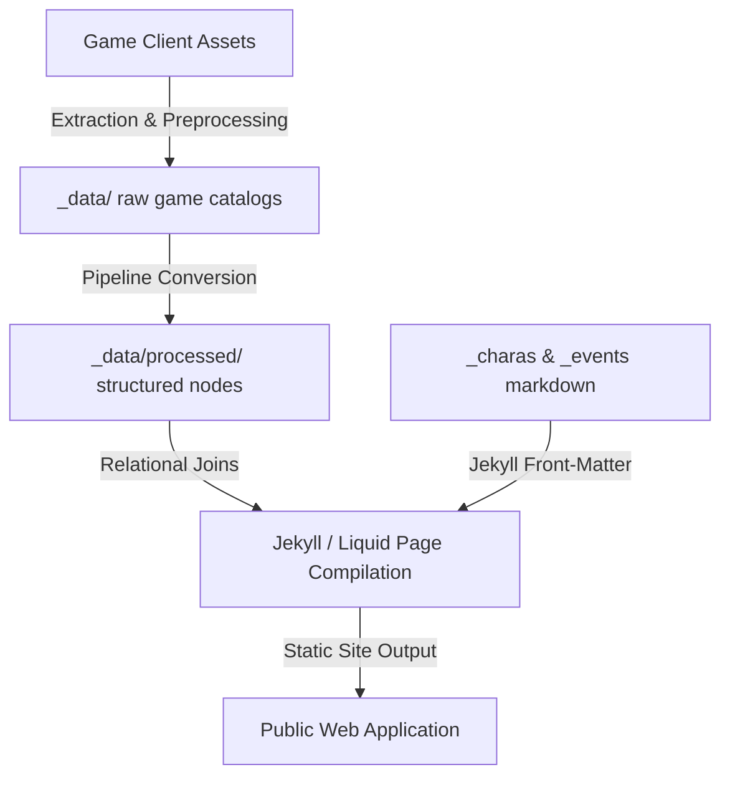

# Live A Hero (LAH) Wiki — Core Architecture

Welcome to the **Live A Hero (LAH) Wiki** developer workspace. This repository is built on a Jekyll-based site engine, fueled by custom data extraction, cleaning, and translation synchronization pipelines.

This document covers the high-level architecture of the project, developer guardrails (Do's and Don'ts), and links to detailed guides for scripts, layouts, and schemas.

## 📂 Project Structure Overview

```text
lah-wiki/
├── _charas/                   # Structured character pages containing YAML front-matter data
├── _events/                   # Event markdown pages detailing quests, gachas, shops, and bonuses
├── _statuses/                 # Generated status pages grouping skills by active/passive effects
├── _data/                     # Game master data and community-maintained translation databases
│   ├── processed/             # Preprocessed master data (e.g. language-filtered serif/bios, pre-rendered skill trees)
│   ├── stores/                # Split shop inventories (one JSON per shop ID)
│   ├── translation/           # Custom local JSON translations parsed from TSV templates
│   └── wiki/                  # Community-sourced static data (e.g. Item.yml, SalesReport.json)
├── _includes/                 # Jekyll/Liquid HTML fragments (e.g. infoboxes, shop-tables, skill components)
├── _layouts/                  # Jekyll HTML layouts defining page wrappers and structural designs
├── _main_quests/              # Main Quests markdown files
├── _plugins/                  # Custom Ruby plugins for Jekyll (e.g. custom Liquid filters and tags)
├── _posts/                    # Jekyll blog post markdown files
├── _sass/                     # SCSS and CSS modules for styling. They get merged into assets/main.scss
├── assets/                    # Site assets (images, scripts, etc.)
├── tools/                     # Python data-engineering pipeline, scraping utilities, and translation syncer
└── zzz/                       # Temp workspace containing raw game localization JSON dumps
```

## 🏛️ Core Architecture Principles

The wiki separates raw game database structures from presentation templates, using Liquid tags, custom Ruby plugins, and Python preprocessing tools to compile static HTML pages.



### 1. Data Separation & Decoupling
Character profile content (`_charas/`) and event sheets (`_events/`) are kept entirely separate from master catalogs (`_data/`). Pages render dynamically via includes using primary keys/IDs (e.g., `characterId` or `eventId`), which lets Jekyll run fast relational joins.

### 2. Multi-Stage Translation Pipelines
Community translations are synchronized with public translation spreadsheets. Local TSVs act as templates, pushing new entries to Google Sheets, and pulling validated translated nodes to structured local JSON dictionaries inside `_data/translation/`.

### 3. XML Parser Guardrails
The community spreadsheets contain complex game style tags (like colors, sizes, or custom styles). To prevent Jekyll compilation failures due to unclosed tags, the downloader utility runs an XML parser validator that acts as a compile-time block.

---

## 📌 Developer DO's and DON'Ts

### ✅ DO's
*   **Maintain Language Fallbacks**: When translation properties are missing or incomplete, the Jekyll layout should automatically fall back to raw Japanese master strings.

### ❌ DON'Ts
*   **No Direct Master JSON Edits**: Never manually edit master databases (e.g., `CardMaster.json`, `SkillMaster.json` in `_data/`). These files are fetched from the CDN and overwritten by the masterdata pipeline. Instead, apply changes in Google Sheets or custom override catalogs.
*   **No Inline CSS Style Blocks**: Avoid styling content directly with inline CSS tags on Markdown pages. Leverage design system variables and tokens structured inside `_sass/`.

---

## 📚 Detailed Developer References

For more in-depth documentation on the different layers of this workspace, refer to the following guides:

* **Python Scripts & Pipelines**: Detailed descriptions, inputs, and outputs of all automation tools.
    *   See [docs/PYTHON_SCRIPTS.md](file:///c:/Users/jie/Github/lah-wiki/docs/PYTHON_SCRIPTS.md)
* **Liquid Templates & Plugins**: How layouts, custom inclusions, and Ruby modules build pages.
    *   See [docs/LIQUID.md](file:///c:/Users/jie/Github/lah-wiki/docs/LIQUID.md)
* **Game Data Schemas & Relationships**: Understanding JSON relational schemas and Liquid joins.
    *   See [docs/DATA_SCHEMAS.md](file:///c:/Users/jie/Github/lah-wiki/docs/DATA_SCHEMAS.md)
