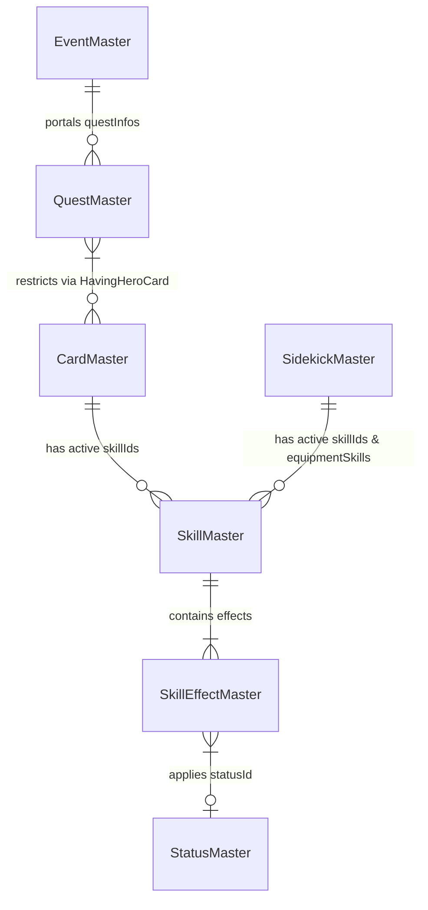

# Live A Hero Wiki — Game Data Schemas & Relationships

The wiki uses a highly structured relational database model, parsed from the game's client master catalogs. Liquid templates queries these JSON objects directly using key-value relationships.

---

## 🗃️ Core Schema Entities

### 1. `CardMaster.json` (playable Hero cards)
*   **Key Fields**:
    *   `cardId` (string): Unique identifier for a card configuration.
    *   `stockId` (int): Identifier for the character card (e.g. `10011` where `1001` is characterId and `1` is the form variant).
    *   `resourceName` (string): Base asset naming prefix (e.g. `marfik`).
    *   `rarity` (int): Rarity (1 to 5 stars).
    *   `element` (int): Element ID (1: Fire, 2: Water, 3: Earth, 4: Light, 5: Shadow).
    *   `role` (int): Combat Role ID (1: Attack, 2: Defense, 3: Assist, 4: Debuff, etc.).
    *   `skillIds` (array of ints): The character's active combat skill IDs.
    *   `growths` (array of objects): Level-by-level progression tables for stats (HP, ATK, SPD, addView).
    *   `skillProvider` (object): Connects passive nodes.

### 2. `SidekickMaster.json` (Sidekicks cards)
*   **Key Fields**:
    *   `stockId` (int): Unique sidekick card identifier.
    *   `resourceName` (string): Asset prefix.
    *   `skillIds` (array of ints): Active skill triggered when sidekick is equipped.
    *   `equipmentSkills` (array of ints): Passive equipment skills unlocked at high intimacy.
    *   `growths` (array of objects): Stats progression table.

### 3. `SkillMaster.json` (Combat Skills)
*   **Key Fields**:
    *   `skillId` (int): Unique skill identifier.
    *   `skillName` (string): Localized skill title.
    *   `description` (string): Skill text description containing custom game tags.
    *   `useView` (int): VP cost required to cast.
    *   `target` (int): Target classification (0: self, 1: ally, 2: enemy, etc.).
    *   `effects` (array of objects): Core mechanical action modifiers referencing `skillEffectId`.

### 4. `SkillEffectMaster.json` (Skill Modifiers & Modulations)
*   **Key Fields**:
    *   `skillEffectId` (int): Mechanical identifier.
    *   `skillEffectJson` (object): Inside, contains:
        *   `statusId` (int): Battle status applied by this effect.
        *   `turn` (int): Duration of the status.
        *   `probability` (int): Chance percentage to apply.
        *   `overrideStatusName` / `overrideStatusDescription` (string): Specific status card descriptions overrides if the skill effect behaves uniquely.

### 5. `StatusMaster.json` (Battle Status Effects)
*   **Key Fields**:
    *   `statusId` (int): Unique status effect index.
    *   `statusName` (string): Localized name (e.g. "ATK Up").
    *   `description` (string): Standard description of the status effect's mechanics.
    *   `isGoodStatus` (int): Classification (0: Debuff, 1: Buff, 2: System/Aura).

### 6. `EventMaster.json` (Game Events & Campaigns)
*   **Key Fields**:
    *   `eventId` (int): Core event key.
    *   `baseResourceName` (string): Prefix folder for the event assets.
    *   `eventPortalJson` (object):
        *   `storeId` (int): Store product catalog reference.
        *   `questInfos` (array): References to associated farm quest chapters.
    *   `questBonusJsons` (array): Multiplier bonuses granting specific heroes and sidekicks bonus points/drops.

---

## 💻 How Jekyll Pages Use Game Schemas

The dynamic parts of Jekyll layouts perform relative relational joins:

### Character Profile Rendering (`chara.html`)
1.  Loads character markdown files under `_charas/` which hold characterId front-matter.
2.  Filters `site.data.CardMaster` and `site.data.SidekickMaster` where `characterId` maps back to the card catalog.
3.  Pulls the skill array `skillIds` for the character, then iterates through `site.data.SkillMaster` to fetch names and descriptions.
4.  For each skill, loops over its inner `effects` list and matches them with `site.data.SkillEffectMaster` to calculate additional details (e.g. target elements, triggers).
5.  If a skill applies a `statusId`, it queries `site.data.StatusMaster` to load status descriptions and icons.

### Dynamic Event Shops (`shop-table.html`)
1.  Given a `storeId` parameter from `_events/<name>.md` or `EventMaster.json`.
2.  Loads `_data/stores/<storeId>.json`.
3.  Each product lists a reward ID (`objectId`) and type (`rewardType`).
4.  If `rewardType` is `3`, it joins with `ItemMaster.json` and overrides with English translations in `_data/wiki/Item.yml`.
5.  If `rewardType` is `1` (Hero) or `2` (Sidekick), it joins with `CardMaster.json` or `SidekickMaster.json` to draw the character portrait.
