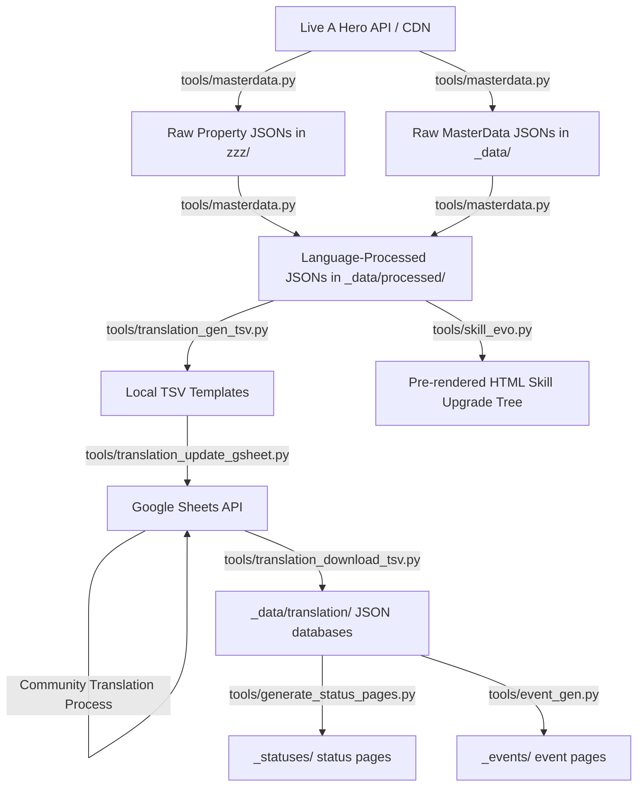

# Live A Hero Wiki — Python Scripts & Automation Tools

All automation scripts are maintained in the root directory or the `tools/` directory. 

## 📂 Core Scripts Reference

### 1. `tools/masterdata.py`
*   **Purpose**: The central pipeline updater. It checks the live gateway API for client/master data updates. If a new version is detected, it downloads the full list of MasterData JSON files from the CDN, stores them in `_data/`, downloads raw localization property files (Japanese, English, Traditional/Simplified Chinese) to `zzz/`, and triggers all required preprocessing steps.
*   **Input Files**:
    *   `tools/masterdata_ver.txt` (local version tracking)
*   **Output Files**:
    *   `tools/masterdata_ver.txt` (updated version string)
    *   `_data/<MasterDataName>.json` (all updated master catalogs)
    *   `zzz/Japanese.json`, `zzz/English.json`, `zzz/ChineseTraditional.json`, `zzz/ChineseSimplified.json`
*   **Preprocess Calls Triggered**:
    *   `processMasterDataCatalog()`
    *   `processShopFile()`
    *   `processCardProfileOverride()`
    *   `processSalesFile()`
    *   `processPropertiesFile()`
    *   `processItemInfo()`

---

### 2. `tools/preprocess.py`
*   **Purpose**: Contains data utility and formatting functions that restructure raw MasterData and asset catalog tables into ordered, clean, and normalized JSON structures suitable for the Jekyll site engine.
*   **Input Files**:
    *   `_data/CardProfileOverrideMaster.json`
    *   `_data/ShopMaster.json`
    *   `_data/SalesMaster.json`
    *   `_data/MasterDataCatalog.json`
    *   `_data/ItemMaster.json`
    *   `_data/wiki/Item.yml`
    *   `zzz/Japanese.json` / `zzz/English.json` (and other localization files)
*   **Output Files**:
    *   `_data/processed/CardProfileOverride.json`
    *   `_data/stores/<id>.json` (individual store files)
    *   `_data/processed/sales_report_master.json`
    *   `_data/MasterDataCatalog_list.json`
    *   `_data/wiki/Item.yml` (merged translated item definitions)
    *   `_data/processed/*_bio.json`, `*_serif.json`, `*_profile.json`, `*_library.json`, `*_sales_report.json`, `*_score_attack.json` (for all language configurations)

---

### 3. `tools/translation_gen_tsv.py`
*   **Purpose**: Generates and formats clean TSV spreadsheets representing game Skills, Skill Effects, and Status elements side-by-side with official English translations (if available in raw `zzz/English.json`). These files act as templates for community members to manually refine translations.
*   **Input Files**:
    *   `_data/SkillMaster.json`
    *   `_data/CardMaster.json`
    *   `_data/SidekickMaster.json`
    *   `_data/SkillEffectMaster.json`
    *   `_data/StatusMaster.json`
    *   `zzz/English.json`
*   **Output Files**:
    *   `skill-jp.tsv` (Skill list spreadsheet layout)
    *   `skill-effect-jp.tsv` (Skill status override details spreadsheet layout)
    *   `status-jp.tsv` (Raw battle status list spreadsheet layout)

---

### 4. `tools/translation_update_gsheet.py`
*   **Purpose**: Synchronizes local TSVs with the community translation Google Sheet (ID: `1PVTqJxN2-VF1TwSdlisrrLgW1vWlRKJSmv1cpCBaY-I`) using the Google Sheets API (`gspread`). It matches records by primary key, appends new rows, patches empty translation cells, sorts worksheets, and sends a Discord webhook report.
*   **Input Files**:
    *   `credentials.json` (or `GOOGLE_CREDENTIALS_JSON` environment variable)
    *   `skill-jp.tsv`, `skill-effect-jp.tsv`, `status-jp.tsv` (generated locally)
*   **Output Web Targets**:
    *   Edits to target worksheets: "EN skill", "EN skill effect", "EN status" in Google Sheets
    *   Discord summary notification via webhook `DISCORD_WEBHOOK_URL`

---

### 5. `tools/translation_download_tsv.py`
*   **Purpose**: Connects to the public Google Sheet published CSV endpoints (or reads local TSVs) to pull down approved community translations, validates HTML/liquid-like markup structure for strict tag closures (to avoid Jekyll breaking), and saves the compiled dictionaries.
*   **Input Files**:
    *   Spreadsheets online CSV streams OR local files `skill-tl.tsv`, `skill-effect-tl.tsv`, `status-tl.tsv` (when `--use_local` flag is provided)
    *   `_data/CardMaster.json`
    *   `_data/SidekickMaster.json`
*   **Output Files**:
    *   `_data/translation/Skill.json`
    *   `_data/translation/SkillV2Whitelist.json` (whitelist of characters with fully translated skills)
    *   `_data/translation/SkillEffect.json`
    *   `_data/translation/Status.json`

---

### 6. `tools/generate_status_pages.py`
*   **Purpose**: Scans all hero and sidekick master data to map skills that apply battle status effects. It automatically generates dedicated Jekyll status page markdown documents grouped by status IDs.
*   **Input Files**:
    *   `_data/CardMaster.json`
    *   `_data/SidekickMaster.json`
    *   `_data/SkillMaster.json`
    *   `_data/SkillEffectMaster.json`
    *   `_data/StatusMaster.json`
    *   `_data/translation/Status.json`
*   **Output Files**:
    *   `_statuses/<status_id>.md` (individual Jekyll markdown status pages)

---

### 7. `tools/event_gen.py`
*   **Purpose**: Automatically scaffolds new event pages under `_events/<pageName>.md` from structured event master definitions, resolving character IDs to page names and building hero/sidekick bonus rewards tables.
*   **Input Files**:
    *   `_data/EventMaster.json`
    *   `_charas/*.md` (used to build character ID maps)
*   **Output Files**:
    *   `_events/<pageName>.md` (scaffolded Jekyll markdown event page template)

---

### 8. `tools/event_patch.py`
*   **Purpose**: A script to patch `_events/` front matter by mapping a page's `banner_image` path back to its corresponding `eventId` in `_data/EventMaster.json` and cleanly injecting it back into the front-matter block.
*   **Input Files**:
    *   `_events/*.md`
    *   `_data/EventMaster.json`
*   **Output Files**:
    *   `_events/*.md` (modified front matter block)

---

### 9. `tools/skill_evo.py`
*   **Purpose**: Parses upgrade branch tables in `SkillUpgradeMaster.json`, performs a depth-first search (DFS) traversal to reconstruct branching upgrade trees, and saves pre-rendered Liquid-compatible `
` HTML tree tags to process skill evolution page displays.
*   **Input Files**:
    *   `_data/SkillUpgradeMaster.json`
*   **Output Files**:
    *   `_data/processed/SkillUpgradeMaster.json`

---

### 10. `tools/sales_report.py`
*   **Purpose**: Extracts event-specific sales dialog translations written directly inside `
` HTML details markers in Jekyll events pages and aggregates them into a centralized JSON lookup table.
*   **Input Files**:
    *   `_events/*.md`
    *   `_data/processed/sales_report_master.json`
    *   `_data/EventMaster.json`
*   **Output Files**:
    *   `_data/wiki/SalesReport.json`

---

### 11. `tools/rewrite.py`
*   **Purpose**: Converts old character markdown structures located in `_charas2/` (which used custom verbose Liquid capturing blocks) into structured, modern, front-matter-driven YAML formatting located in `_charas/`.
*   **Input Files**:
    *   `_charas2/*.md`
*   **Output Files**:
    *   `_charas/*.md`

---

### 12. `tools/wiki_util.py` / `tools/wiki_util_test.py`
*   **Purpose**: Provides text-sanitizing utilities that parse game-specific style tags (like `<color=...>`, `<size=...>`, `<style="オート行動">`, etc.) and formats them into clean web-safe standard tags (like HTML spans, classes, `<wiki-passive>`, `<wiki-auto-action>`). Also provides test suites to validate regex performance.
*   **Input/Output**: Utility function libraries imported by most data pipeline scripts.

---

### 13. `preprocess.py` (root directory)
*   **Purpose**: Preprocesses and optimizes game assets. Currently configured to optimize and compress raw PNG banner/survey assets under `Sprite` and survey directories, converting them to compressed, web-ready progressive JPGs using Pillow (`PIL`).
*   **Input Files**:
    *   `Sprite/banner_*.png`
    *   `assets/img/survey-2025/*.png`
*   **Output Files**:
    *   `Sprite/banner_*.jpg`
    *   `assets/img/survey-2025/*.jpg`
